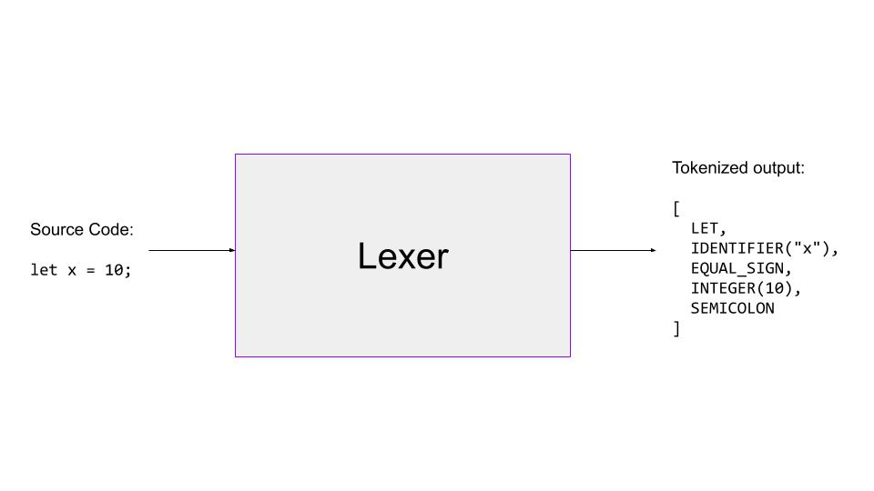

# Chapter 1 - Lexing

## Terminology

**Lexer**: a program that performs lexical analysis by separating source code into tokens

**Token**: a sequence of characters representing a unit of information or piece of 'vocabulary' in the language e.g. keyword, operator

**Lexeme**: an instance of a token i.e. a sequence of characters which match a pattern that corresponds to a
token

## What is a Lexer

A Lexer is the first step in the process of interpretation or compilation. It's purpose is to take source code as an 
input, and convert it into a sequence of tokens as an output. This process is known as [_Lexical Analysis_](https://en.wikipedia.org/wiki/Lexical_analysis).
The lexer reads the input, and categorizes each 'word' or node encountered as matching an atomic element
of the programming language. For example `2 + 3`, will be converted to something like:

```
[
  INTEGER(2),
  PLUS_SIGN,
  INTEGER(3)
]
```

Later, these tokens will be used by the parser to form an [Abstract Syntax Tree](https://en.wikipedia.org/wiki/Abstract_syntax_tree). 



## Lexical Analysis in the Monkey Interpreter

The Monkey Lexer fulfils the following:

- Reads source code input
- Identifies a token based on input characters
- Removes non-tokens from code e.g. whitespace 

The Monkey Lexer does not perform validation of the incoming code, to verify that it is syntactically correct
Monkey Code. It simply reads in the input and converts it into tokens.

Lexers may also remove other non-tokens from the code, such as comments.

### Step 1: Define tokens

We need to define the types of tokens that can be output by the program. To begin with we start with
a relatively limited selection e.g. integers, identifiers, operators, and extend the selection as we
expand the lexer to handle more complicated code.

### Step 2: Lexing

The lexer receives an input as a string. It has two pointers, one to the current position and
the other to "peek" ahead at the next character in the input. The purpose of the second pointer,
is to handle scenarios where the lexer needs to know the next character in order to decide the type of token. For
example `=` (used for assignment) will be assigned to a different token than `==` (used for equality).

The Lexer is structured to perform the following steps:

1. Receives input as string
2. Read the next character and advance position
3. Assign a token to the current character
4. Advance the pointers
5. Continue until the end of the file/input is reached

## Error Handling

In the Monkey Interpreter, we need to prepare for scenarios when an input is received,
which doesn't match a known token type. We handle this scenario, by assigning it to
the type `ILLEGAL`.

Some Lexers may also attribute other meaningful data to a token, such as the column number, line number or filename. This
can enable meaningful error messages when running the interpreter e.g.

```
"Error: expected semicolon. line 12, column 23."
```

## Monkey REPL

In order to interact with the Monkey interpreter (apart from writing tests), we create
a REPL. A REPL **r**eads the input, **e**valuates it, **p**rints the output and **l**oops
(starts again). While we don't yet have the ability to evaluate, we can still create a REPL
which reads, lexes and prints!

