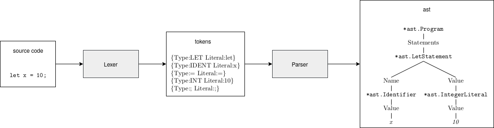

# Chapter 2 - Parsing

## Theory

*main source besides our book: the [Dragon Book](https://en.wikipedia.org/wiki/Compilers:_Principles,_Techniques,_and_Tools)*

*TODO*

## Parsing the Monkey Programming Language

### Basic Example

### Type of Parser

* recursive descent parser
* top down operator precedence parser = Pratt parser

### Language Subset

The Parser in chapter 2 implements only a large subset of the Monkey programming language (here represented by nodetypes of the AST):

* Program
* LetStatement
* ReturnStatement
* ExpressionStatement 
* BlockStatement 
* Identifier
* Boolean
* IntegerLiteral
* PrefixExpression
* InfixExpression
* IfExpression
* FunctionLiteral
* CallExpression

The rest follows in chapter 4:

* StringLiteral
* ArrayLiteral
* IndexExpression
* HashLiteral 

