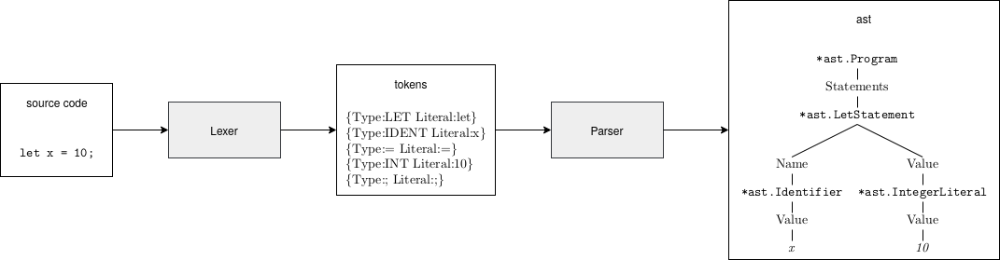

# Chapter 2 - Parsing

## Theory

*main source besides our book: the [Dragon Book](https://en.wikipedia.org/wiki/Compilers:_Principles,_Techniques,_and_Tools)*

### Parser

A Parser both checks its input for syntactical correctness and produces a data structure representing the input.

For parsers for programming languages, this data structure is usually an **A**bstract **S**yntax **T**ree.

### Parser Generators

A parser generator is not restricted to one specific programming language.
Its input are formal descriptions of languages and for each formal description of a language, it outputs a parser.

Examples for parser generators: yacc, bison, ANTLR, ...

The formal description is usually some notation for *something close to* context-free grammars(CFGs). 
(There are often additions to notations for context-free grammars: rules for associativity and operator precedence)

### Ambiguity

Programs shouldn't be ambiguous. They should have one fixed meaning.
Since evaluation/translation in an interpreter/compiler is based on a data structure like an AST, there should be exactly one AST for each program, and thus, each constituent of a program. 

There is a variety of means to resolve ambiguities:

* brackets 
* Polish notation (all operators are prefix)
* rules for associativity and operator precedence 

Operators can be specified by their 
* position (prefix / infix / postfix)
* associativity (left / right)
* precedence class/number

#### Associativity 

 * left-associaticity: E1 op E2 op E3 means (E1 op E2) op E3
 * right-associaticity: E1 op E2 op E3 means E1 op (E2 op E3)

#### Operator Precedence

 * If op1 has higher precedence than op2, E1 op1 E2 op2 E3 means (E1 op1 E2) op2 E3 
 * If op2 has higher precedence than op1, E1 op1 E2 op2 E3 means E1 op1 (E2 op2 E3) 

## Parsing the Monkey Programming Language

### Basic Example

### Type of Parser Implemented in the Book

* recursive descent parser
* top down operator precedence parser = Pratt parser

### Language Subset

The Parser in chapter 2 implements only a large subset of the Monkey programming language (here represented by nodetypes of the AST):

* Program
* LetStatement
* ReturnStatement
* ExpressionStatement 
* BlockStatement 
* Identifier
* Boolean
* IntegerLiteral
* PrefixExpression
* InfixExpression
* IfExpression
* FunctionLiteral
* CallExpression

The rest follows in chapter 4:

* StringLiteral
* ArrayLiteral
* IndexExpression
* HashLiteral 

