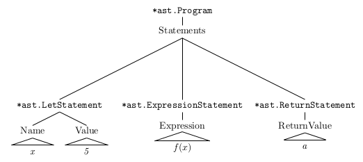
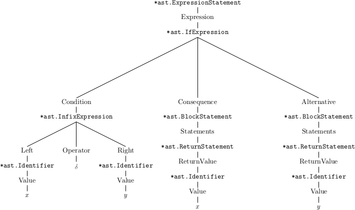
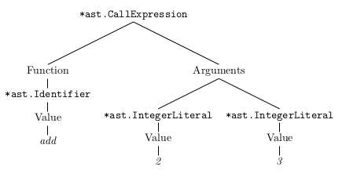

# Nodes of the Monkey-AST


*Note: only for the subset of the Monkey Programming Language implemented in chapter 2; there will be four more Node-types implemented in chapter 4.*

*Note: all AST-diagrams are semi-automatically produced by an extension of the packages ast / repl. They show the internal representation of 
AST-nodes.*

## Monkey Programs and Statements

### Programs
Every valid Monkey program is a series of statements.

### Statements vs Expressions

Examples for expressions:

```
5
add(5, 5)
```

Examples for statements:

```
let x = 5
return 5;
```
Roughly: Expressions produce values, statements don’t.
Yet, there are also __Expression Statements__.


There are three kinds of statements a program can consist of: __Return Statements__, __Let Statements__ and __Expression Statements__.

### Return Statements

Examples:
```
return a
return 10;
return add(15);
```
Structure:
```
return <expression>[;]
```
Corresponding Fields of AST Node:
```
ReturnValue Expression
```
### Let Statements

Examples:
```
let x = 5;
let barfoo = 5*5 / 10 + 18 - add(5,5) + multiply(124);
let anotherName = barfoo;

```
Structure:
```
let <identifier> = <expression>[;]
```
Corresponding Fields of AST Node:
```
Name *Identifier
Value Expression
```


### Expression Statements

Examples:
```
x + 10;
f(a)
```
Structure:
```
<expression>[;]
```

Corresponding Fields of AST Node:
```
Expression Expression
```

### A First Example Program and its corresponding AST

Program:

```
let x = 5
f(x);
return a
```

Response in REPL:
```
>> let x = 5 f(x); return a
let x = 5;f(x);return a;
```

AST:



```
let x = 5 f(x); return a
```

We even habe another type of statements: __Block Statements__, although this kind of statement right now only occurs as part of __If Expressions__ and __Function Literals__, thus feeding a Block Statement into the REPL is answered by an errormessage:

```
>> {let a = 5}
            __,__
   .--.  .-"     "-.  .--.
  / .. \/  .-. .-.  \/ .. \
 | |  '|  /   Y   \  |'  | |
 | \   \  \ 0 | 0 /  /   / |
  \ '- ,\.-"""""""-./, -' /
   ''-' /_   ^ ^   _\ '-''
       |  \._   _./  |
       \   \ '~' /   /
        '._ '-=-' _.'
           '-----'
Woops! We ran into some monkey business here!
 parser errors:
        no prefix parse function for { found
        no prefix parse function for } found
>> 
```

Block statements are a series of statements enclosed by an opening { and a closing }.


## Expressions

### Simple Expressions

Examples:
```
thorsten
false
12345
```


Corresponding Fields of AST Nodes:
```
Value string   //   Identifier
Value bool     //   Boolean
Value int64    //   IntegerLiteral
```

AST:


### Expressions Formed With Prefix- and Infix-Operators

#### Prefix Expressions


Examples:
```
-5;
!foobar;
5 + -10;
!isGreaterThanZero(2);
5 + -add(5, 5);
!-5			// can be stacked; no type checking so far
```

Structure:
```
<prefix operator><expression>	//no semicolon !!
```

Corresponding Fields of AST Node:
```
Operator string
Right    Expression
```

AST:


```
!foobar 
```

#### Infix Expressions

Examples:
```
5 + 5;
5 - 5;
5 * 5;
5 / 5;
5 > 5;
5 < 5;
5 == 5;
5 != 5;
```

Structure:
```
<expression> <infix operator> <expression>
```
	
Corresponding Fields of AST Node:
```
Left     Expression
Operator string
Right    Expression
```

AST:


```
5 == 5
```


### If Expressions, Function Literals and Block Statements 

#### If Expressions

Examples:
```
if (x > y) {
  return x;
}

if (x > y) {
  return x;
} else {
  return y;
}

let foobar = if (x > y) { x } else { y }; // as value of let statement
```

Structure:
```
if (<condition>) <consequence> [else <alternative>]
```

The braces are part of consequence and alternative, because both are block statements.

Corresponding Fields of AST Node:
```
Condition   Expression
Consequence *BlockStatement
Alternative *BlockStatement
```


AST:


```
if (x > y) {  return x;}	
```



```
if (x > y) {  return x; } else {  return y; }
```


```
let foobar = if (x > y) { x } else { y }; 
```

#### Function Literals

In Monkey a function literal is how we define functions: which parameters they have and what the function does. 
Parameters are just a list of identifiers that are comma-separated and surrounded by parentheses.

Examples:
```
fn(x, y) { return x + y; }

fn() { return foobar; }

let myFunction = fn(x, y) { return x + y; }  	// as part of a let statement

fn() {						// a function literal as the expression in a
  return fn(x, y) { return x > y; };		// return statement inside another function literal
}

myFunc(x, y, fn(x, y) { return x > y; });	// Using a function literal as an argument when calling another function
```

Structure of Function Literals:
```
fn <parameters> <block statement>
```

Corresponding Fields of AST Node:
```
Parameters []*Identifier
Body       *BlockStatement
```
AST:


```
fn(a, b) { let foobar = a + b; return foobar; }
```

### Call Expressions

Examples:
```
fibonacci(5)
add(2,3) 
f()						// empty argument list
add(2 + 2, 3 * 3 * 3)				// complex expressions as arguments
add(fibonacci(5),1)				// recursive 
callsFunction(2, 3, fn(x, y) { x + y; }); 	// function literal as argument
fn(x, y) { x + y; }(2, 3)			// function literal instead of function name

```

Structure:
```
<expression>(<comma separated expressions>)
```

Corresponding Fields of AST Node:
```
Function  Expression  // Identifier or FunctionLiteral
Arguments []Expression
```

AST:



```
add(2,3) 
```


```
fn(x, y) { x + y; }(2, 3)
```


## Questions / Problems

### Questions with regard to Block Statements

* shouldn't block statements be allowed as parts of programs?
   * and why should they not be nested?
   * after all, they implement the interface Statement
   * would allowing block statements to be parts of programs / other block statements make evaluation harder (maybe because of scoping)?

```
{let a = 1 }			// parser error

if (true) {			// works
	let a = 1 
}

if (true) {			// parser error
	{ let a = 1; let b = 2;} 
	return 5; 
}
```


### A Problem Concerning Function Literals

* do we want to allow any token as a parameter?
  * and should they be treated as identifiers?

```
fn(true){} 
fn(1){}
fn(if){}
fn(,){}

```


```
fn(a, 1, true,,,if){} 
```

If is **not** the lexer's fault, as the following diagram that shows the tokens fed into the parser shows:


```
fn(a, 1, true,,,if){} 
```

### A Problem Concerning the Function Field of Call Expressions

* do we want to allow any expression in the function-field?
* or should we rather restrict them to identifiers and function literals?

```
true(a)				// boolean
1(a)				// integer
if (1){}()			// if expression

```


```
f() true()  1()
```


