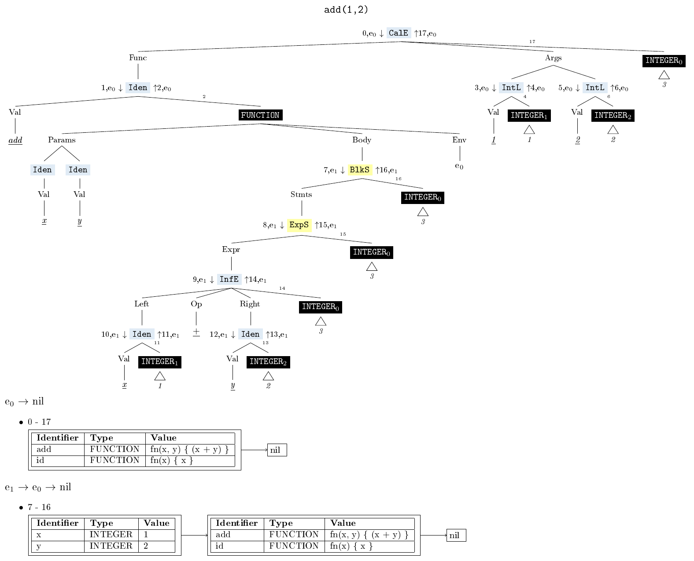
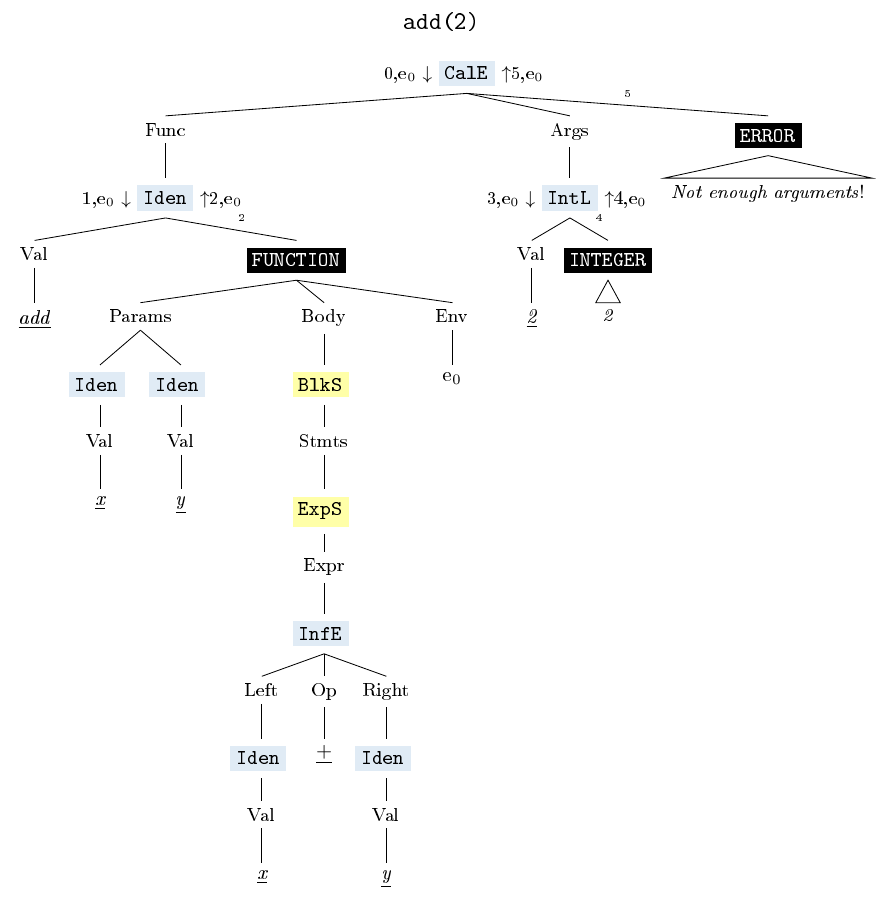
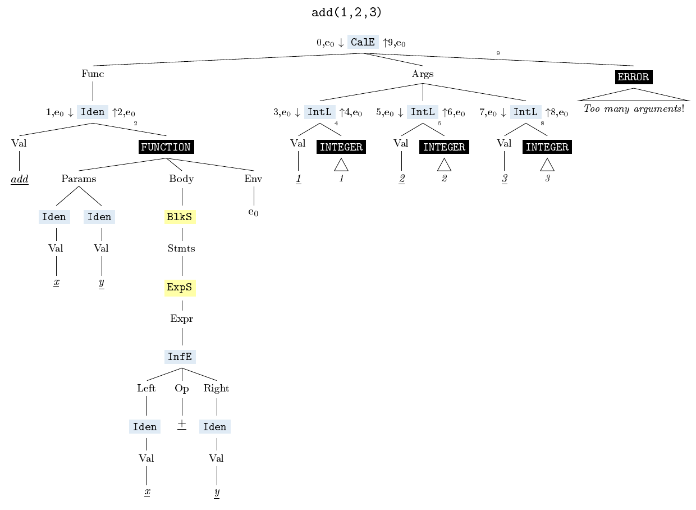

# :monkey: Chapter 3 - Evaluation

## :monkey: Promises and Problems

#### Promises
> Expressions produce values, statements don’t. (Interpreter Book: 33)

>  [W]e’re going to represent every value we encounter when evaluating Monkey source code as
an **Object**, an interface of our design. Every value will be wrapped inside a struct, which fulfills
this Object interface.(Interpreter Book: 108)

#### Problems
https://stackoverflow.com/questions/66841082/why-does-the-monkey-repl-panic-at-my-program

There are now tests added to the original code that especially lay focus on edge cases and collect input that causes the evaluator to panic. :scream:

## :monkey: The Directory `playground3`

... contains 
- the original code from the interpreterbook (including the MIT license) **after chapter 3** 
- **PLUS** additional tests marked by an "add"-infix for parser and evaluator
  - there is some explanation/documentation for these tests in  [this](https://github.com/Tiffilore/monkey-business) (rapidly-changing) repo, currently [here](https://github.com/Tiffilore/monkey-business/blob/main/parser/README.md) and [here](https://github.com/Tiffilore/monkey-business/blob/main/evaluator/README.md)

... may serve as a **playground** for us to fix the bugs and experiment with the implementation.

## :monkey: Fix tests

### Arity of Call Expressions

In a mob programming session, we first specified the expected behaviour of the interpreter and then fixed the test `TestArityCallExpressions` (in file `evaluator_add_test.go`). This also fixes the test `TestPanicNotEnoughArguments` (in file `evaluator_add_panic_test.go`), which does not aim at specification but only at documenting (former) triggers for the evaluator to panic.

Before, the evaluator would panic if a function was called with an insufficient numbers of arguments. After the fix, it now returns an error object in these cases. Additionally, we decided that to return an error message also if a function is called with too many arguments (though the evaluator did not panic in these cases before, but simply ignored the supernumerary arguments).

#### Example: `add`

Let's have a closer look at function calls that call the function `add`, defined by `let add = fn(x){x + y}`.

In function calls with the **right number of arguments**, the function body is evaluated in an extended environment - e1 - that binds the parameters of the function object to the objects the arguments of the function call evaluate to:

In function calls with **not enough arguments**, the function body is no longer evaluated at all, but an error object is returned:

In function calls with **too many arguments**, the function body is also no longer evaluated, but an error object is returned:

