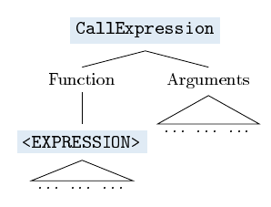
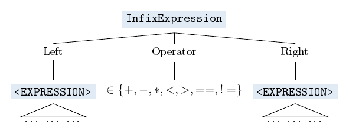
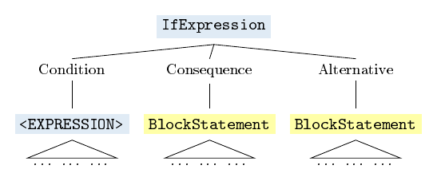
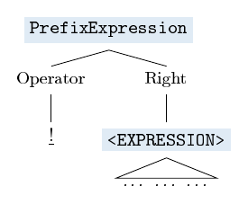

# :monkey: Chapter 3 - Evaluation

## :monkey: Promises and Problems

#### Promises
> Expressions produce values, statements don’t. (Interpreter Book: 33)

>  [W]e’re going to represent every value we encounter when evaluating Monkey source code as
an **Object**, an interface of our design. Every value will be wrapped inside a struct, which fulfills
this Object interface.(Interpreter Book: 108)

#### Problems
https://stackoverflow.com/questions/66841082/why-does-the-monkey-repl-panic-at-my-program

There are now tests added to the original code that especially lay focus on edge cases and collect input that causes the evaluator to panic. :scream:

## :monkey: The Directory `playground3`

... contains 
- the original code from the interpreterbook (including the MIT license) **after chapter 3** 
- **PLUS** additional tests marked by an "add"-infix for parser and evaluator
  - there is some explanation/documentation for these tests in  [this](https://github.com/Tiffilore/monkey-business) (rapidly-changing) repo, currently [here](https://github.com/Tiffilore/monkey-business/blob/main/parser/README.md) (for additional parser tests) and [here](https://github.com/Tiffilore/monkey-business/blob/main/evaluator/README.md) (for additional evaluator tests)

... may serve as a **playground** for us to fix the bugs and experiment with the implementation.

## :monkey: Fix tests

### Arity of Call Expressions

In a mob programming session, we first specified the expected behaviour of the interpreter and then fixed the test `TestArityCallExpressions` (in file `evaluator_add_test.go`). This also fixes the test `TestPanicNotEnoughArguments` (in file `evaluator_add_panic_test.go`), which does not aim at specification but only at documenting (former) triggers for the evaluator to panic.

Before, the evaluator would panic if a function was called with an insufficient numbers of arguments. After the fix, it now returns an error object in these cases. Additionally, we decided that to return an error message also if a function is called with too many arguments (though the evaluator did not panic in these cases before, but simply ignored the supernumerary arguments).

#### Example: `add`

Let's have a closer look at function calls that call the function `add`, defined by `let add = fn(x){x + y}`.

In function calls with the **right number of arguments**, the function body is evaluated in an extended environment - e1 - that binds the parameters of the function object to the objects the arguments of the function call evaluate to:

In function calls with **not enough arguments**, the function body is no longer evaluated at all, but an error object is returned:

In function calls with **too many arguments**, the function body is also no longer evaluated, but an error object is returned:

### :construction_worker_woman: Division by zero

The evaluator panics if it tries to evaluate an infix expression that divides an integer by a zero value.

:arrow_right: to fix: `TestDivisionByZero` (in file `evaluator_add_test.go`) => `TestPanicDivisionByZero` (in file `evaluator_add_panic_test.go`)

- specify error message 
- fix code

### :construction_worker_woman: Panic at the face of `nil` 

The evaluator panics if expressions that are evaluated to nil, occur in certain fields:

- in the _Function_ field of a call expression:

- in the _Right_ field of a prefix expression with the MINUS operator:

- in the _Left_ or _Right_ field of an infix expression:

This is documented by the test `TestPanicWithNil` (in file `evaluator_add_panic_test.go`)

For this problem, there are no corresponding specification tests in file `evaluator_add_test.go`, since there are several options to cure this problem:

- providing cures for each time an expression evaluating to `nil` occurs in these fields 
- revisiting Monkey's object system and not allowing it to evaluate to `nil` any more.
  - to live up to one of the book's promises:

>  [W]e’re going to represent every value we encounter when evaluating Monkey source code as
an **Object**, an interface of our design. Every value will be wrapped inside a struct, which fulfills
this Object interface.(Interpreter Book: 108)

### :construction_worker_woman: Specify Boolean evaluation

The tests provide a framework to specify explicitly how expressions are to be evaluated in **Boolean contexts** and test whether Boolean evaluation is consistent.

**Spoiler**: it is consistent right now, but the specification is done twice in the code. That means that consistency has to be maintained "manually". This will become increasingly harder if the language is changed or extended(e.g. by Boolean operators such as `&&`or `||`).

 - tests: `TestEvalToBoolCorrectness` and `TestEvalToBoolConsistency` (in file `evaluator_add_test.go`)

In its current form, there are two contexts that ask for Boolean evaluation of expressions:

- expressions in the _Condition_ field of an if expression:

- expressions in the _Right_ field of an prefix expression with the Bang operator:

:arrow_right: specify boolean correctness in `specifyEvalToBoolean` (in file `evaluator_add_test.go`)

object type | values
---|---
`Boolean` | true, false
`Integer` | -1, 0, 1
`Null` | the one and only null object
`Error` | any
`Function` | any

:arrow_right: make code consistent and correct

