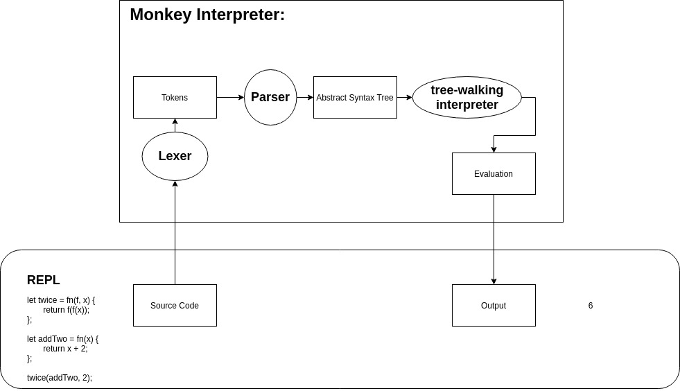

# Chapter 0 - overview of an interpreter

<a name="top"></a>

## What is an Interpreter

### Wikipedia

*... an interpreter is a [computer program](https://en.wikipedia.org/wiki/Computer_program) that directly [executes](https://en.wikipedia.org/wiki/Execution_(computers)) instructions written in a [programming](https://en.wikipedia.org/wiki/Programming_language) or [scripting language](https://en.wikipedia.org/wiki/Scripting_language), without requiring them previously to have been [compiled](https://en.wikipedia.org/wiki/Compiler) into a [machine language](https://en.wikipedia.org/wiki/Machine_language) program.*

An interpreter generally uses one of the following strategies for program execution:*

1. Parse the source code and perform its behavior directly; (Early versions of Lisp programming language and Dartmouth BASIC )
2. Translate source code into some efficient intermediate representation and immediately execute this; (Perl, Python, MATLAB, and Ruby )
3. Explicitly execute stored precompiled code[1] made by a compiler which is part of the interpreter system. (UCSD Pascal)

**Monkey Interpreter is an example of number 2.**

## From Source Code to Execution

Source code is a human (programmer) readable representation of a program. To execute it, it needs to be converted to machine code. This is generally speaking a sequence of zeroes and ones that represent instructions the computer’s CPU can execute. To get machine code from source code, we need either an interpreter or a compiler.

Each program could be directly written in machine code (and it was done that way in the early days of programming!). What we use today are higher level languages that are more convenient to use and thus allow us to program much faster (and hopefully with less errors).

It is also possible to display these machine instructions in a more readable format, the so-called assembly languages. Each instruction can either be expressed as a binary number or as an instruction in an assembly language.

Example in MIPS:
(https://en.wikipedia.org/wiki/Machine_code#Assembly_languages)

| Bits      | 6                             | 26                   |
| --------- | ----------------------------- | -------------------- |
| contain   | opcode (operation to execute) | values for operation |
| *example* | *jump*                        | *target address*     |

## Interpreter vs. Compiler

There are many different programming languages and many different use cases for each. In all cases, the program source code needs to be translated to machine code. Some languages use interpreters and some use compilers (and some fall somewhere in between).

*Both compilers and interpreters convert source code (text files) into tokens, both may generate a parse tree, and both may generate immediate instructions. The basic difference is that a compiler system, including a (built in or separate) [linker](https://en.wikipedia.org/wiki/Linker_(computing)), generates a stand alone machine code program, while an interpreter system instead performs the actions described by the high level program.* (https://www.geeksforgeeks.org/compiler-vs-interpreter-2/)


An interpreter functions like a human interpreter who repeats the spoken word phrase by phrase into a different language.
A compiler on the other hand can be compared to a translator, who takes a written text, translates it into a different language and distributes the translated text.

**Both types have different strengths and weaknesses:**

|                                      | Interpreter                                | Compiler                                                                            |
| ------------------------------------ | ------------------------------------------ | ----------------------------------------------------------------------------------- |
| Speed of translation to machine code | faster                                     | Slower because more steps involved                                                  |
| Speed of code execution              | Slower, translation                        | Faster (“hard” work is done in advance during compilation)                          |
| Time of translation                  | During execution                           | Before execution                                                                    |
| Process of translation               | Line by line                               | All at once                                                                         |
| Memory consumption of translation    | Less memory needed                         | More memory needed (creates additional intermediate object code)                    |
| location                             | Needs to be present on machine of user     | Only executable file needs to be on user’s machine                                  |
| repetition?                          | Executed every time the program is running | Executed once, not required for running program                                     |
| Distribution                         | Same code can be distributed to each user  | Might need to compile platform specific versions, each user needs the right version |
| Debugging                            | Easier -> errors are thrown after each line| Harder, errors are hard to locate                                                   |
|                                      | → Good for cross platform code             | → good for efficient code                                                           |

An approach that unites some advantages of both is the Just in Time compiler (JIT compiler): In this case the code is compiled just before it is executed. The JIT compiler needs to be present on the user’s machine (just like an interpreter).

It may use the source code directly (like the V8 engine for javascript) or a intermediate representation of the program in byte code (like JAVA).
https://en.wikipedia.org/wiki/Just-in-time_compilation 
https://en.wikipedia.org/wiki/Bytecode 

### Language Examples

**Compiled:**  Go, C, C++

**Interpreted:** PHP, Perl, Python, Ruby

**Both:** Javascript


## Breaking it down piece by piece

- ### Lexer (also called tokenizer or scanner)

*“...the process of **converting a sequence of characters** (such as in a computer program or web page) **into a sequence of tokens** (strings with an assigned and thus identified meaning).”*
https://en.wikipedia.org/wiki/Lexical_analysis

In the simplest form a lexer reads a string and splits it into substrings separated by whitespace (which characters are considered whitespace may vary). Each substring can then be analyzed and converted into a token:

-  a value (3, "dog")
- a reserved keyword (var, func, ....)
- a special character (COLON, OPENING_PARENTHESIS, ...)
- ....

Depending on the programming language, it might need to consider some context around the substring to classify the tokens correctly. 


- ### Parser

A parser is a software component that **takes input data (frequently text) and builds
a data structure** – often some kind of parse tree, **abstract syntax tree** or other
hierarchical structure – giving a **structural representation of the input**, checking for
correct syntax in the process. [...] The parser is often preceded by a separate lexical
analyser, which creates tokens from the sequence of input characters;
https://en.wikipedia.org/wiki/Parsing#Parser

In short: A parser turns its input into a data structure that represents the input.

- ### Evaluator

Evaluate the structural representation of the input to determine the output.


## Interpreters can also include compiling steps

*“Before the interpreter takes over, Python performs three other steps: **lexing, parsing, and compiling**. Together, these steps transform the programmer's source code from lines of text into structured code objects containing instructions that the interpreter can understand. **The interpreter's job is to take these code objects and follow the instructions.***

*You may be surprised to hear that compiling is a step in executing Python code at all. Python is often called an "interpreted" language like Ruby or Perl, as opposed to a "compiled" language like C or Rust. However, this terminology isn't as precise as it may seem. **Most interpreted languages, including Python, do involve a compilation step**. The reason Python is called "interpreted" is that the compilation step does relatively less work (and the interpreter does relatively more) than in a compiled language.”*
http://aosabook.org/en/500L/a-python-interpreter-written-in-python.html


## Why Go

- Familiarity
- Tooling from GO
- Thorough standard library
- Simplicity
- Easy to map to other languages


## The Monkey Programming Language



https://drive.google.com/file/d/1nSQDrDiTuKbz9d_gNwY2CCDDDjt9DoMY/view?usp=sharing

Expressed as a list of features, Monkey has the following:

- C-like syntax
- variable bindings
- integers and booleans
- arithmetic expressions
- built-in functions
- first-class and higher-order functions (functions as arguments)
- closures
- a string data structure
- an array data structure

Bind values to names in:

```go
let age = 1;
let name = "Monkey";
let result = 10 * (20 / 2);
let myArray = [1, 2, 3, 4, 5];
let myHash = {"name": "Thorsten", "age": 28};
```

Accessing values:

```go
myArray[0] // => 1
myHash["name"] // => "Thorsten"
```

Bind functions to names:

```go
let add = fn(a, b) { return a + b; };
```

Supports implicit return values:

```go
let add = fn(a, b) { a + b; };
```

Calling functions:

```go
add(1, 2);
```

***

## Discussion Points

**Q:** In go is it compiled into machine code or itermediate? Runtime in binary? what process is happening here?
**A:** yes runtime is included needed for gc. Static dynamic linking is related to size of binary
**T:** For GO Cross compilation required for running on different platrforms(ie arm)
**T:** Optimisation process - translation happens once, does also not need to be even onmachine of ther user so plenty of time for optimisation. In interpreter optimisations need to be more considered because they affect execution speed.
**Q:** Will an interpreter not execute on syntax error, but will run if other errors are present and only exit when it hits the error?
**T:** Are we talking runtime errors or general errors?
**Q:** Will lexing and parsing happen first for the whole code or scope by scope for Monkey - the bets are on
**A:** Python - seems to go expression by expression and only errors when it reaches the error, js seems to go scope by scope
**T:** Lets later on benchmark or own interpreter and see if we can optimize it by interpreting “on demand” (not all at once, but statement by statement)

## Additional Resources

* Small code interpreter challenge on codewars https://www.codewars.com/kata/526156943dfe7ce06200063e/train/python
* Esoteric programming language https://en.wikipedia.org/wiki/Esoteric_programming_language

***

|  [Back to Book Main Page](./README.md) | [Back to Top](#top) | [Next chapter](chapter-1.md) |
